# Advanced Time Series Forecasting and Anomaly Detection in Transactional Data

**Authors:**  
- Fabio Antonicoli  
- Francesca Romana Galeppi  
- Matteo Piccirilli  

---

## Abstract

This work presents a hybrid approach for forecasting and anomaly detection in time-based transactional data, using advanced deep learning techniques. In order to overcome the limited size of the original dataset, various data augmentation methods were tested (Gaussian perturbation, autoregressive modeling, LSTM Autoencoder, and Generative Adversarial Networks – GAN). A comparison is also provided between different anomaly detection methodologies (forecast-based and unsupervised, with classical techniques such as Isolation Forest, One-Class SVM, and LSTM Autoencoder).

The results show that a “baseline” LSTM model achieves the best predictive performance in terms of MAE, RMSE, MAPE, and R², while the data augmentation approaches offer useful insights into their effectiveness and possible limitations. In addition, a multiscale dynamic threshold anomaly detection system is illustrated, which proved robust and adaptive in various real-world scenarios.

---

## 1. Introduction

In industrial and financial contexts, the ability to forecast transactional loads and detect anomalies in a small amount of time is crucial to ensure business continuity and optimal resource allocation. Analyzing transactional time series enables:

- Anticipation of demand peaks.
- Detection of potential attacks or system errors.
- Optimization of operating costs, thanks to more accurate resource planning.

However, in real practice, transactional datasets can be small or contain incomplete information. Hence, it is essential to use data augmentation strategies and adopt deep learning architectures capable of capturing complex patterns and multivariate relationships.

In this study, several synthetic data generation techniques (LSTM Autoencoder, GAN, etc.) are explored and their impact on the training of predictive and anomaly detection models is evaluated. Furthermore, outlier detection methods of the forecast-based type (based on the prediction error of an LSTM regressor) are compared with unsupervised approaches such as Isolation Forest, One-Class SVM, and LSTM Autoencoder.

**Goal**:  
Develop a robust pipeline for anomaly detection in time series by using deep learning techniques (LSTM, Autoencoder, GAN) for generating synthetic data (Synthetic Time Series Generation). Given the absence of a labeled dataset containing anomalies in the time series, classical unsupervised models (Forecast Error Thresholding, Isolation Forest, One-Class SVM, Moving Statistics Deviation) were chosen to identify unusual transactional patterns in operational data, even without an explicit ground truth.

---

## 2. Methods

This section outlines the methodological approach used to develop our forecasting and anomaly detection pipeline on transactional time series data.

### 2.1 Data Preprocessing

We started by importing and cleaning the raw dataset:
- Converted timestamps and sorted the data chronologically.
- Renamed columns for clarity.
- Handled missing values and inconsistencies.

We performed **Exploratory Data Analysis (EDA)** to understand data distributions, seasonality patterns, and correlations between key variables. Notably, we visualized:
- Transaction volume over time
- Heatmaps by hour of the day
- Correlation matrix of numeric features

To reduce noise and stabilize variance, we applied:
- **Rolling mean smoothing** (window = 10)
- **Log transformation** on positive transaction values

We then conducted **seasonal decomposition** to separate trend, seasonal, and residual components using additive models.

### 2.2 Sliding Window & Feature Engineering

We created input sequences using a **sliding window approach** (24 time steps) and defined the target as the number of transactions immediately following each window. Features were standardized using `StandardScaler`.

A **time-aware train/test split** (80/20) was performed to preserve the chronological order of data.

### 2.3 Forecasting Models

Our core forecasting model was a **univariate LSTM regressor**, trained to predict future transaction volumes. We evaluated performance using:
- MAE (Mean Absolute Error)
- RMSE (Root Mean Squared Error)
- MAPE (Mean Absolute Percentage Error)
- R² (Coefficient of Determination)

### 2.4 Synthetic Data Generation (Augmentation)

To address the small size of the dataset, we applied different data augmentation techniques:
- **LSTM Baseline** 
- **LSTM Autoencoder reconstruction**
- **GAN-based synthetic time series** using the `TimeGAN` model from `ydata-synthetic`

### 2.5 Anomaly Detection Methods

We explored both forecast-based and unsupervised anomaly detection techniques:
- **Forecast-based thresholding**: dynamic thresholds on LSTM prediction errors 
- **Isolation Forest**: tree-based anomaly detection
- **One-Class SVM**: kernel-based anomaly detection
- **LSTM Autoencoder**: reconstruction error analysis


### 2.6 Pipeline Overview

Below is a schematic representation of our pipeline:

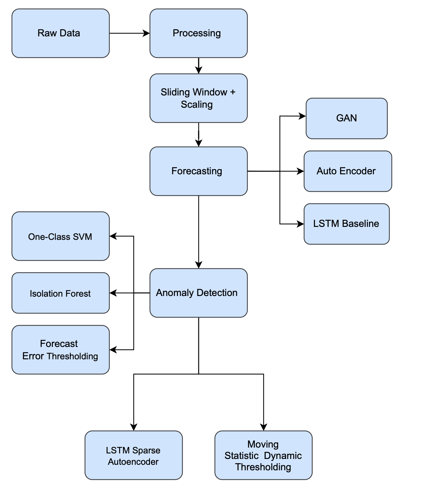

### 2.7 Dataset Description

The dataset under examination includes transactional data collected in time sequence with the following variables:

1. Timestamp  
2. Number of Transactions  
3. Time Min  
4. Time Max  
5. Time Aug  
6. Retries  
7. Wrong Transactions  

All variables are numerical. The goal is twofold:

- **Forecasting future transaction volumes.**  
- **Identifying anomalous deviations (anomaly detection)** relative to the patterns considered “normal.”

### 2.8 Environment Setup

Development was done in Python 3.12.2.  
Main libraries: `pandas`, `numpy`, `scikit-learn`, `matplotlib`, `seaborn`, `tensorflow`, `ydata-synthetic`.

To replicate our environment:
```bash
conda env create -f env.yml
```
Ecco un codice Markdown tecnico e riassuntivo per la configurazione di un ambiente Conda su Windows, ideale da includere in un README o documentazione tecnica:

###  Conda Environment Setup (Windows)

1. Create a New Environment
```bash
conda create -n tf_env python=3.10
conda activate tf_env

```
2. Install Core Packages
```
pip install tensorflow
pip install pandas
pip install scikit-learn
pip install matplotlib
pip install seaborn
pip install jupyter
pip install openpyxl
```
3. Launch Jupyter Notebook
```
jupyter notebook
```


---

## 3. Exploratory Data Analysis (EDA)

### 3.1 Time Series Visualization

Initially, the time series were plotted to identify short- and long-term trends and any daily or weekly (seasonal) patterns. This analysis revealed:

- Daily variability with possible outliers due to demand peaks or service slowdowns.
- Potential intra-daily seasonal effects with peaks at specific times (., around 6:00 PM/ 7:00 PM).

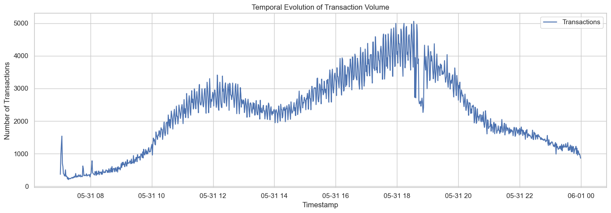

### 3.2 Correlation Heatmap

Linear correlation between the variables was analyzed using a heatmap of the Pearson correlation. From this analysis, the following patterns were observed:

- A strong correlation (0.89) was found between **Retries** and **Time Max**, suggesting that an increase in failed transaction attempts leads to longer maximum transaction times.
- A moderate negative correlation with **Time Min**, **Retries** indicating that in the presence of many failed attempts, the minimum times tend to decrease (likely due to transactions failing almost immediately).

It is important to note that correlation does not necessarily imply causation: relationships among variables should be interpreted with caution.

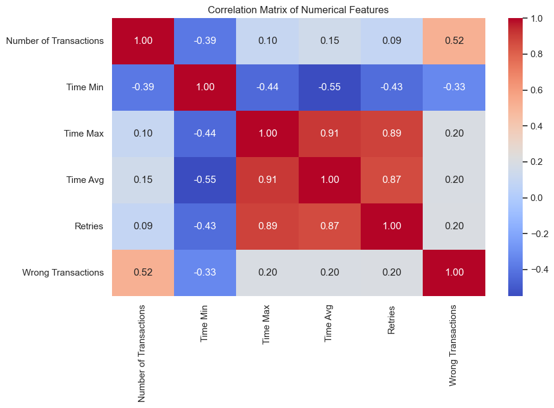

### 3.3 Hourly Heatmaps

Intra-daily seasonality analyses were carried out using hourly heatmaps, highlighting the presence of peaks and troughs in specific time intervals.

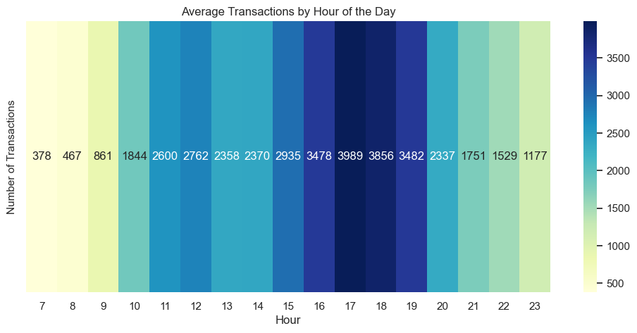

This plot shows a heatmap of average transactions by hour of the day.
There is a clear peak between 3:00 PM and 6:00 PM, with the highest value at 5:00 PM (3989 transactions).
Lighter colors indicate lower activity ( 7:00 AM with 378 transactions), while darker shades highlight the busiest hours, revealing intra-daily seasonality.

---

## 4. Preprocessing and Feature Engineering

To prepare the data for use in deep learning models:

1. **Logarithmic transformation**: The number of transactions was log-transformed to reduce variance and handle skewed distributions.  
2. **Rolling mean over windows of 10 hours**: To smooth short-term volatility.  
3. **Sliding window**: Input sequences for the model are formed from 24 consecutive time steps (24 hours) to predict future steps.  
4. **StandardScaler**: All variables were normalized (mean = 0, variance = 1) to improve neural network convergence.  

**Train/test split**: Split in temporal order (80% training, 20% test) to respect the sequential structure of the data.
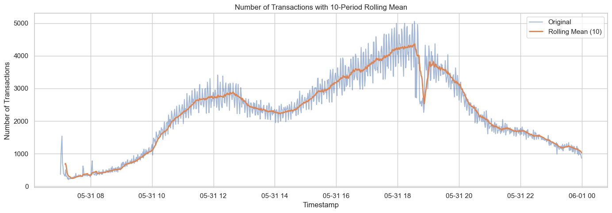
---

## 5. Forecasting Models

### 5.1 Theoretical Overview of RNNs and LSTMs

Recurrent Neural Networks (RNN) are designed for processing sequential data, where each time step may depend on the previous ones. However, traditional RNNs suffer from the vanishing gradient problem, which makes learning long-term dependencies difficult.

**LSTMs (Long Short-Term Memory)** introduce a cell state that flows through the network almost unchanged, regulated by three fundamental gates:

- **Forget gate**: Determines what information to discard.  
- **Input gate**: Decides which new information to add to the memory.  
- **Output gate**: Controls what to output and pass on to the next hidden state.  

Thus, LSTMs can capture dependencies over long time horizons, making them particularly suitable for time series forecasting problems.

### 5.2 Baseline LSTM Model

An LSTM model was implemented with:

- 1 LSTM layer of 64 neurons.  
- 2 intermediate dense (fully-connected) layers.  
- 1 regression output layer (1 neuron) to predict future transaction volume.  

**Training**:

- Use of **EarlyStopping** with `patience = 5` epochs, to prevent overfitting when the validation metric stops improving.  
- StandardScaler normalization of features and target.

**Evaluation (on the test set)**:

- MAE: ~162.12  
- RMSE: ~204.51  
- MAPE: ~11.59%  
- R²: ~0.5418  

From the plotted results, we can see that the forecasts are reasonably good. The model tends to underestimate or overestimate the anomalous peaks, but it captures trends and regular patterns effectively.
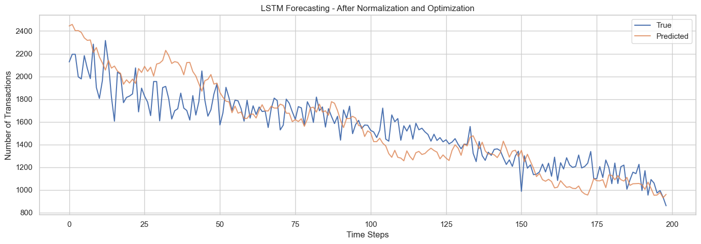

### 5.3 Data Augmentation Approaches

To address the limited availability of data, various synthetic data generation methods were tested:

1. **Gaussian Perturbation**: Gaussian noise was added to the existing data.  
2. **Autoregressive Modeling**: Synthetic samples were generated using AR parameters estimated from the series.  
3. **LSTM Autoencoder (for Sequence-to-Sequence Augmentation)**  
   - **Encoder**: Learns a compact representation of the sequence.  
   - **Decoder**: Reconstructs the sequence, introducing realistic variations. The reconstructed sequences are added to the dataset as synthetic examples.  
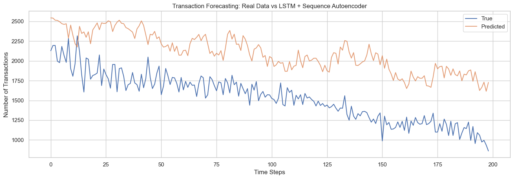

4. **GAN (TimeGAN)**:  
   - A generator produces sequences similar to the real ones from random noise.  
   - A discriminator tries to distinguish between real and synthetic sequences.
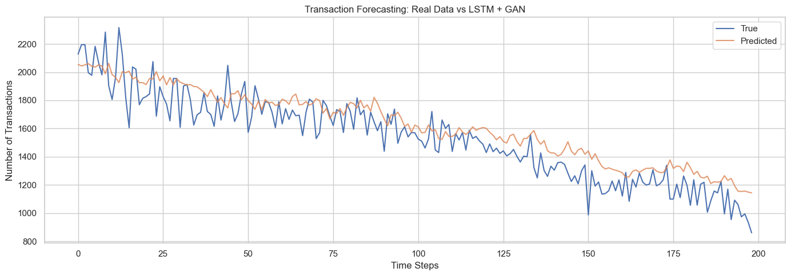

### 5.4 Evaluation Metrics

The quality of the forecasts was assessed using:

1. **Mean Absolute Error (MAE)**  
   \[
   \text{MAE} = \frac{1}{n} \sum_{i=1}^n \left| y_{\text{observed}}^i - y_{\text{predicted}}^i \right|
   \]

2. **Root Mean Squared Error (RMSE)**  
   \[
   \text{RMSE} = \sqrt{\frac{1}{n} \sum_{i=1}^n \left( y_{\text{observed}}^i - y_{\text{predicted}}^i \right)^2}
   \]

3. **Mean Absolute Percentage Error (MAPE)**  
   \[
   \text{MAPE} = \frac{100\%}{n} \sum_{i=1}^n \left| \frac{y_{\text{observed}}^i - y_{\text{predicted}}^i}{y_{\text{observed}}^i} \right|
   \]

4. **Coefficient of Determination (R²)**  
   \[
   R^2 = 1 - \frac{\sum_{i=1}^n (y_{\text{observed}}^i - y_{\text{predicted}}^i)^2}{\sum_{i=1}^n (y_{\text{observed}}^i - \overline{y_{\text{observed}}})^2}
   \]

It should be noted that comparing real and synthetic data using these metrics can be misleading if the synthetic data distribution differs significantly from the real one.

### 5.5 Comparison Results

- **LSTM Baseline**  
  Remains the most robust solution, with the best performances in terms of MAE, RMSE, MAPE, and R².

- **Autoencoders**  
  Generate plausible data, but do not necessarily improve forecasting; they sometimes cause shifts and overfitting.

- **GAN**  
  On small datasets, they exhibit instability and large variance in generating synthetic examples, worsening forecasting metrics.

| Model               | MAE    | RMSE   | MAPE    | R²       |
|---------------------|--------|--------|---------|----------|
| **LSTM Baseline**   | 162.12 | 204.51 | 11.59%  | 0.5418   |
| **Autoencoder LSTM**| 211.70 | 251.08 | 16.82%  | 0.3187   |
| **GAN-LSTM**        | 458.37 | 482.23 | 32.24%  | -1.5477  |

In summary, although data augmentation is conceptually advantageous (enriching the dataset), in this case it did not outperform the LSTM approach using only real data.

The LSTM Baseline is clearly the winner. The use of synthetic data (autoencoder, GAN) did not improve forecasting performance; in fact, it revealed potential overfitting issues or distribution mismatches.

The baseline LSTM model proved effective despite the limited dataset, thanks to its intrinsic ability to capture long-term temporal relationships. The augmentation strategies:

- **Autoencoders**: Generate plausible but often overestimated data.  
- **GAN**: Suffer from instability and excessive variation when the original dataset is too small.

From the standpoint of R², a low or high value may reflect not only the model’s accuracy but also differences in data variance between synthetic and real data. Metrics like MAE and MAPE proved more robust in this context.

**LSTM vs LSTM - GAN**  
While the LSTM-GAN model produces forecasts that look visually realistic and follow the general trend of the data, it does not outperform the optimized baseline LSTM in practice. The baseline LSTM provides more accurate predictions, both in terms of overall trend and local fluctuations. In contrast, the GAN-based model tends to overestimate values and smooth out important variations, leading to higher errors across all evaluation metrics (MAE, RMSE, MAPE).

**LSTM and LSTM - Autoencoder**  
**Comparison of Loss During Training LSTM and LSTM + Autoencoder**  
The chart shows the evolution of the loss function during the training of the LSTM and LSTM + Autoencoder models over the first 6 epochs. The horizontal axis represents the number of epochs, while the vertical axis shows the loss value, which reflects the model’s error during training.

- **Epoch 0**: Both models start with a fairly high error, but the pure LSTM shows a significantly higher initial loss, indicating it starts from a less favorable condition compared to the autoencoder version.  
- **Epoch 1**: There is a steep drop for both models. This is when the initial weights are rapidly adjusted based on the loss feedback. The two models converge to very similar values.  
- **Epochs 2 to 5**: The LSTM model continues to improve, progressively reducing the loss. Its curve flattens, indicating that learning is slowing down. By contrast, the LSTM + Autoencoder model shows a more modest decline and stabilizes earlier, suggesting it struggles to generalize or may be more prone to overfitting.

This comparison indicates that, in this specific experiment, the simple LSTM model achieved better optimization of the objective function, succeeding in capturing temporal patterns more effectively than its autoencoder-enhanced version.


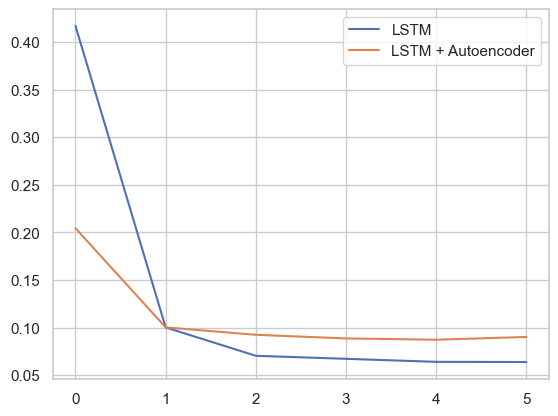

---

## 6. Anomaly Detection

For anomaly detection, several approaches were considered:

1. **Forecast Error Thresholding**  
   Based on the difference between the LSTM’s predicted value and the observed value.

2. **Isolation Forest (IF)**  
   An unsupervised method that randomly partitions the data space and evaluates the “isolation” level of a point.

3. **One-Class SVM (OC-SVM)**  
   Defines a boundary around the “normal” data, labeling as outliers the points lying outside this boundary.

4. **LSTM Autoencoder**  
   Computes the reconstruction error and uses a threshold to define anomalies.

### 6.1 Forecast Error Thresholding (LSTM Model)

This approach is based on comparing the LSTM’s prediction with the actual value. The error is calculated for each time step:

\[
\text{error} = y_{\text{observed}} - y_{\text{predicted}}
\]

Over the distribution of these errors, a static threshold is set:

\[
\text{Threshold} = \mu(\text{error}) + k \times \sigma(\text{error})
\]

where \( k \) is typically a small integer ( 2 or 3). If the error exceeds this threshold, the point is classified as an anomaly.

This approach heavily depends on the predictive performance of the LSTM model: if the forecast is poor, the anomaly detection will also be unreliable.

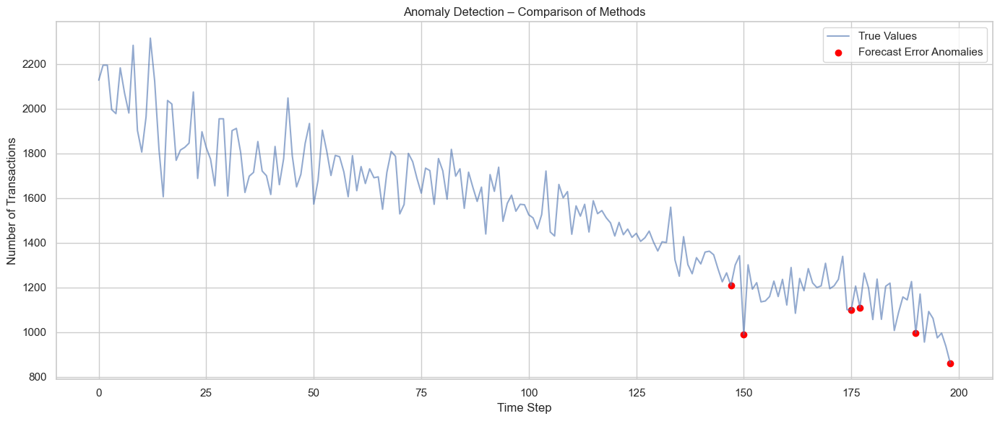

### 6.2 Isolation Forest (IF)

Isolation Forest partitions the data space using random trees. Anomalies (rare or extreme points) tend to be isolated faster, thus receiving a high anomaly score. It does not require a forecasting model and does not explicitly exploit the time dimension.

It can produce numerous false positives if the natural variability of the data is high.

From the plotted results, anomalies appear at the extremes of the time series. A common reason is the so-called “edge effect” or “boundary effect”: at the beginning and end of the time series, the model has less context (fewer past or future data), so it labels those observations as “anomalous” because, compared to the central part of the series, it lacks sufficient historical or future reference to determine if the value is truly anomalous or just part of a legitimate trend.

In general, boundary points are often penalized because:

- Lack of past data at the start (the model “doesn’t know” what came before).  
- Lack of future data at the end (the model “cannot see” if the value fits into a broader upcoming trend).  
- Reduced window for comparison: if a rolling window is used, fewer examples are available at the edges.

These structural limitations can prompt the algorithm to produce false positives for anomalies precisely at the first and last points of the series.

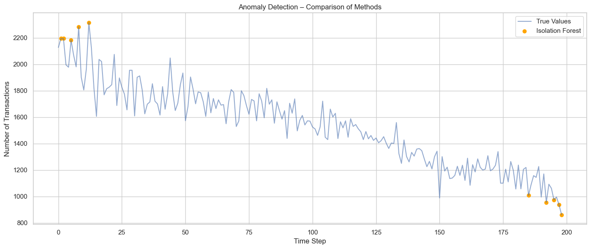

### 6.3 One-Class SVM (OC-SVM)

Another unsupervised technique that builds a decision function to separate most of the data from the rest of the space. Data that fall outside this boundary are labeled as anomalies.

**Strengths**:
- Does not require anomaly labels.

**Weaknesses**:
- If poorly calibrated, it can flag too many anomalies (overfitting the training data).
- Sensitive to the choice of kernel and hyperparameters ( `nu`, `gamma`, etc.).

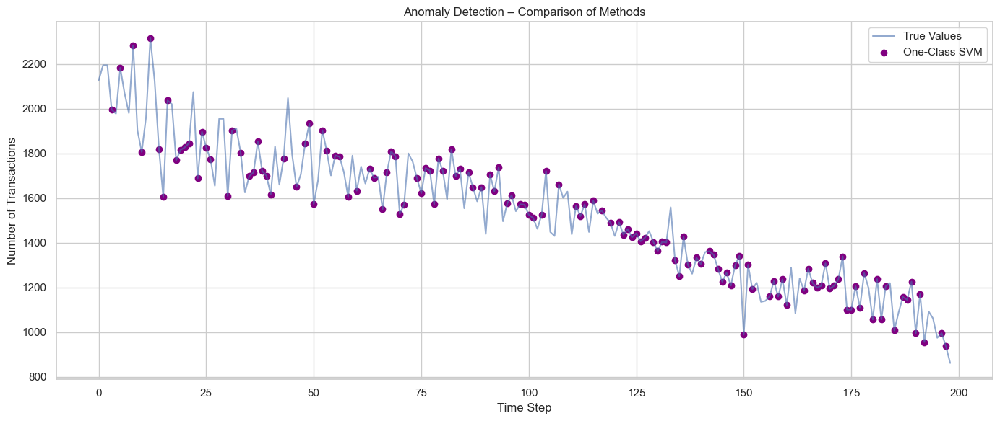

### 6.4 Comparison of Results

- **Forecast-based (LSTM)**  
  Works well if the prediction quality is high.

- **Isolation Forest and One-Class SVM**  
  Useful in fully unsupervised contexts, but require careful parameter tuning to avoid false positives and false negatives.

A further option is the use of a **multivariate LSTM Autoencoder**, which learns the reconstruction of “normal” sequences and flags outliers as those with a high reconstruction error.

---

## 7. LSTM Sparse Autoencoder for Anomaly Detection

An Autoencoder attempts to compress (encoder) and then reconstruct (decoder) the input data, learning a representation of what is considered “normal.” In the case of a **Sparse Autoencoder**, a sparsity constraint is placed on the hidden layers, forcing the model to use only a subset of active neurons to represent each input.

**Advantages of sparsity**:

1. **Focus on essential features**: The model captures only the most recurrent components.  
2. **Better separation of “normal” vs. “anomalous”**: Outliers cause a markedly high reconstruction error.  
3. **Implicit regularization**: Sparsity reduces overfitting risk.  
4. **Interpretability**: By analyzing the “active” neurons, one can glean insights into the patterns learned.

### 7.1 Anomaly Detection with Dynamic Threshold

1. Calculate the reconstruction error for each time step.  
2. Define a dynamic threshold based on a moving average and moving standard deviation over a rolling window ( 10–24 points):

   \[
   \text{Threshold}_{\text{locale}} = \text{rolling\_mean}(\text{error}) + k \times \text{rolling\_std}(\text{error})
   \]

3. If the reconstruction error exceeds this local threshold, the point is classified as anomalous.

**Advantages**:
- Adaptation to trends and gradual changes.  
- Reduced false positives due to simple shifts in the series.

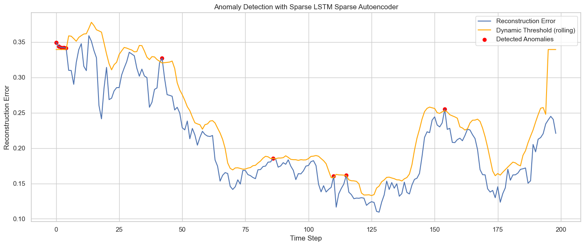

**Reconstruction Error (blue line)**  
Represents, for each time step, the reconstruction error computed by the Autoencoder. If the model can faithfully reconstruct the data, the error remains low. Conversely, higher values indicate that the network “struggles” to reproduce the input sequence, suggesting a potential anomaly.

**Dynamic Threshold (orange line)**  
This adaptive threshold is computed using a rolling mean and rolling standard deviation over a window of 10 points, with a multiplying factor ( \( k = 1.5 \) ):

\[
\text{Dynamic Threshold} = \text{Rolling Mean} + k \times \text{Rolling Std}
\]

Within every 10-time-step window, the mean and standard deviation of the error are evaluated. This approach enables the orange line to adapt to slow changes or trends, flagging as outliers only those errors that deviate significantly from the local norm.

**Detected Anomalies (red dots)**  
Red dots mark time steps where the reconstruction error (blue line) exceeds the dynamic threshold (orange line). In other words, the model indicates that the observed value at those positions is difficult to reconstruct relative to the learned patterns, thus labeling them as anomalies or outliers.

---

## 8. Feature Analysis and Outliers Using Moving Statistics

An additional strategy for detecting anomalies in multivariate time series is to analyze, for each feature, the deviation from the local moving average (rolling window).

Formally, a value is considered an outlier if:

\[
\vert \text{value}_t - \text{rolling\_mean}_t \vert > \lambda \times \text{rolling\_std}_t
\]

where \(\lambda\) is a sensitivity parameter, typically between 2 and 3.

**Moving Average and Standard Deviation (rolling)**  
For each feature, a moving average over a window of width \(\text{rolling\_window}=24\) is calculated, along with the corresponding moving standard deviation. This provides a “local” view of how the series behaves over that time segment.

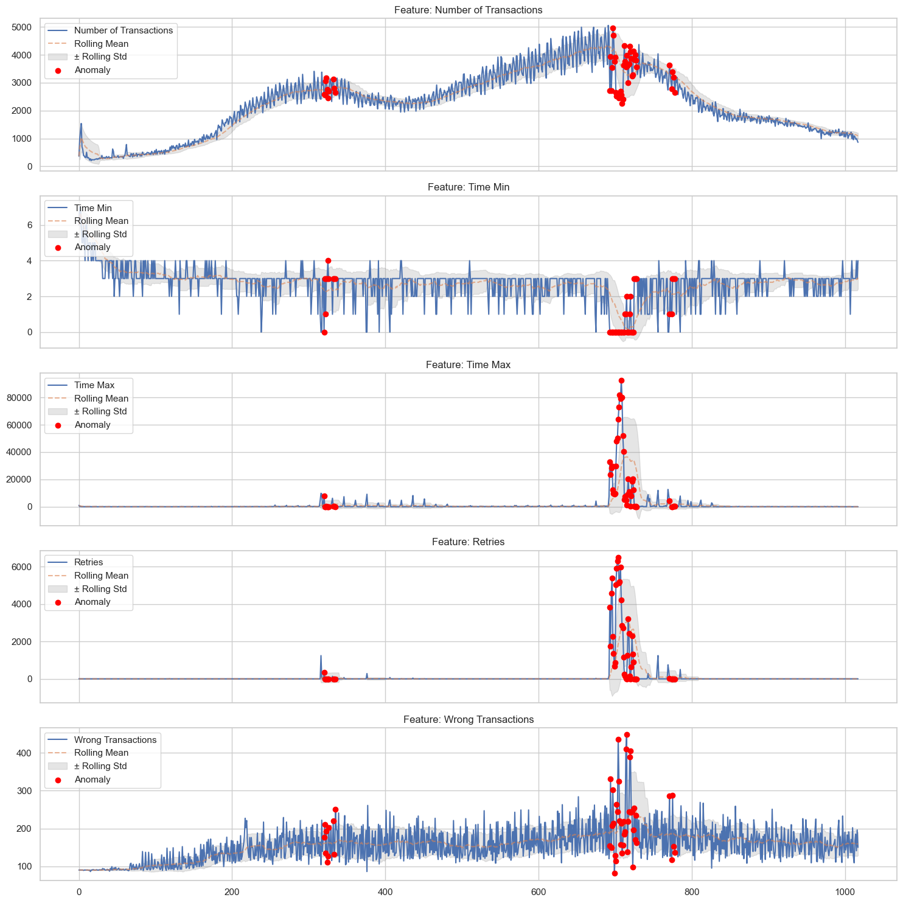

### 8.1 Qualitative Observations

In the presence of the flagged anomalies, we observe the following patterns:

- **Number of Transactions**:  
  Rapid increases and peaks (around time frames 700–750) generated several outliers.

- **Time Min**:  
  Close to 0 with negative or positive spikes associated with errors. Anomalies are concentrated in zones of abrupt variation.

- **Time Max**:  
  Often near 0, but around index 700–750 there is a massive spike (tens of thousands), indicative of a slowdown or system malfunction.

- **Retries**:  
  Almost always near zero. The peaks coincide with high **Time Max** values.

- **Wrong Transactions**:  
  Tends to rise gradually, with anomalies coinciding with the peaks in the other variables.

---

## 9. Conclusions and Future Developments

In conclusion, the main findings of this study can be summarized as follows:

### Forecasting

- A baseline **LSTM** model proved to be the best choice in terms of MAE, RMSE, MAPE, and R².  
- Data augmentation strategies (Autoencoders and GAN) did not outperform the baseline, mainly due to the small dataset size and potential variance/instability issues.

### Anomaly Detection

- **Forecast Error Thresholding** works well if the predictive model is reliable.  
- **Unsupervised approaches** like **Isolation Forest** and **One-Class SVM** require careful parameter tuning to avoid false positives, but are useful when a good predictive model is unavailable.  
- **Autoencoders**, especially in the sparse variant, showed good capability in discriminating “normal” from anomalous patterns, particularly with a dynamic (rolling) threshold.

### Dynamic Thresholds

Using rolling thresholds (mean + \(k \times \text{std}\)) on moving windows makes anomaly detection more robust, adapting to natural shifts in the series.

---

### Future Developments

- **Dataset expansion** with additional data sources to improve model generalization.  
- **Implementation of TimeGAN** on larger datasets, exploring strategies to stabilize training.  
- **Extension of Autoencoder architectures** with attention mechanisms to enhance reconstruction in the most critical time segments.  
- **More sophisticated feature engineering** ( calendar-based features or market indicators) to enrich the model.

---

Even though the pipeline presented is subject to data availability constraints, it outlines a complete approach to time series forecasting and anomaly detection in real transactional contexts, paving the way for further improvements and customizations according to the specific application domain.

### In this project, AI was used to provide better translation using DeepL
